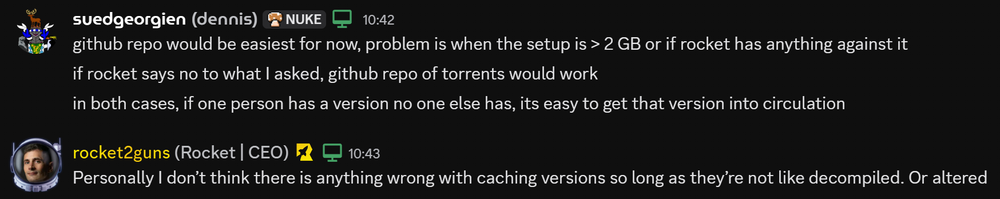

# 🚀 Kitten Space Agency - Version Archive

---

## Purpose

Source behind https://ksa-archive.net.

The purpose of this repository is to preserve every possible version of the game.
That gives everyone the opportunity to go back to the very early days of the game and see how it evolved and how it turned into whatever it will turn into in the future.
---

## Contributing

You have a build which the archive is missing? You can help:
- **Open an issue** with the build number and the installer file(s)

or
- **Contact me on Discord** - You will find me by the name: `suedgeorgien`

---

## Permissions

We got permissions as long as we don't use this archive to decompile or alter those setups.
This is purely to archive all possible versions of KSA for the future.

## Verifiability

As soon as the KSA developer provide hashes for the installer files, I will make sure to add them to the website.
Trusting a random website on the internet is okay in most cases, but I do not want to leave those behind who are careful with that kind of stuff.
